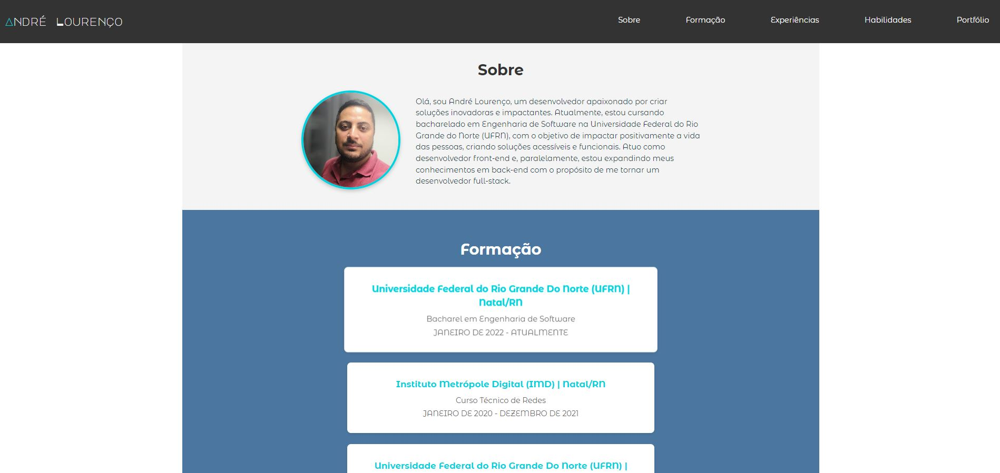

# React + TypeScript + Vite

# Portifolio

Neste webSite eu mostro meus projetos, ferramentas que uso em programação e me apresento :)

#### Visualize aqui: https://andrelourencogit.github.io/andre-dev-journey/



### 🛠 Tecnologias

As seguintes ferramentas foram usadas na construção do projeto:

- React
- Sass
- Material-ui
- React Bootstrap
- Animate css
- React typical

### 🏁 Features

- [x] Dinamicidade na apresentação
- [x] Dinamicidade na tela de conhecimentos
- [x] Dinamicidade na tela de Portfólio

#### 🧭 Rodando a aplicação web

```bash

# Clone este repositório
$ git clone https://github.com/Andrelourencogit/andre-dev-journey.git

# Instale as dependências
$ npm install

# Execute a aplicação em modo de desenvolvimento
$ npm run dev


```

---
